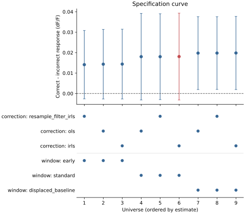

# Descriptive IBL feedback multiverse v0.1

This post-hoc public-data demonstration runs nine dF/F workflows on four IBL
animals. It is not confirmatory evidence for a biological feedback effect.
Correctness was observed rather than randomized and can covary with stimulus,
movement, expectation, and trial history.

The protocol was frozen before aggregate multiverse execution in
[`benchmarks/protocol-ibl-multiverse-v0.1.md`](https://github.com/aeronjl/fiberphotometry/blob/main/benchmarks/protocol-ibl-multiverse-v0.1.md).
The compact numerical artifact is
[`benchmarks/ibl-feedback-multiverse-v0.1.json`](https://github.com/aeronjl/fiberphotometry/blob/main/benchmarks/ibl-feedback-multiverse-v0.1.json),
and `scripts/run_ibl_feedback_multiverse.py` recreates the complete materialized
pipelines and provenance from public data.

The curve orders universes by their point estimate; this ordering is descriptive,
not an inferential ranking. Blue points are alternative universes and the red point
is the reference IRLS/standard-window workflow. Rebuild it from the frozen JSON,
without downloading source data, using
`uv run python scripts/plot_ibl_feedback_multiverse.py`.

## Results

All nine workflows executed and produced positive correct-minus-incorrect dF/F
contrasts. Estimates ranged from 0.0141 to 0.0198, with a median of 0.0180. No
smallest effect of interest was declared, so no practical-effect robustness
fraction is reported.

Correction choice had little effect on its median:

- OLS: 0.01802
- robust IRLS: 0.01808
- resample, low-pass, robust IRLS: 0.01802

Window choice mattered more:

- early 0–0.25 s response: 0.01434
- standard 0–0.5 s response: 0.01802
- displaced -1.0–-0.2 s baseline: 0.01978

The intervals for the early and standard windows included zero. The displaced
baseline intervals excluded zero narrowly, with nominal paired-t p-values near
0.039. That change is evidence of analytical sensitivity, not a reason to prefer
the nominally significant window after seeing the data.

The reference IRLS/standard-window estimate was 0.01808 with a 95% interval of
[-0.00316, 0.03932]. Leaving out one animal at a time produced estimates from
0.01418 to 0.02422. With only three animals remaining in each calculation, this
is a sensitivity diagnostic rather than a population analysis.

## Separate-scale raw comparator

The earlier acquired-fluorescence estimate was 0.0000960 with a 95% interval of
[-0.0000268, 0.0002188]. It is linked but deliberately excluded from the dF/F
robustness distribution: its units and outcome construction differ, so numerical
agreement or disagreement in magnitude would not be meaningful.

## Interpretation

Within this deliberately small universe, the result direction is stable to the
tested correction methods but its interval is sensitive to event-window choice.
The simulation benchmark already showed that agreement among reference-based
methods cannot establish that the reference is valid. Nothing here resolves
that identifiability problem, the observational correctness contrast, or the
four-animal sample size.

The prospectively frozen expansion protocol is
[`benchmarks/protocol-ibl-feedback-prospective-v0.2.md`](https://github.com/aeronjl/fiberphotometry/blob/main/benchmarks/protocol-ibl-feedback-prospective-v0.2.md).
It cannot be activated by counting the existing animals' repeated sessions as new
replicates; it has an explicit new-animal readiness gate.
