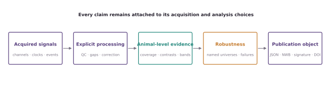

# FiberPhotometry

**Auditable fiber-photometry analysis from acquired signals to inference across
animals.**

FiberPhotometry is a Python library and command-line workflow for scientists who
need to understand how preprocessing choices affect their result—not simply obtain
one corrected trace. It preserves subjects, sessions, events, channels, exclusions,
parameters, and uncertainty throughout the analysis.

!!! warning "Development status"

    This is a pre-release research tool. The documentation distinguishes
    **supported**, **experimental**, **planned**, and **out-of-scope** methods.
    Experimental availability is not a claim of scientific validation.

## Find your question

| I want to… | Start with |
|---|---|
| Run an event-aligned comparison across animals | [First event analysis](product-workflow-v0.1.md) |
| Analyze CSV/TSV exports without rewriting code | [Configuration-first CLI](cli-v0.1.md) |
| Import a TDT block | [TDT import](tdt-import-v0.1.md) |
| Work from public NWB data | [DANDI tutorial](tutorials/dandi-000971-reward-multiverse.md) |
| Combine DeepLabCut, SLEAP, MoSeq or BORIS with photometry | [Behavioral ecosystem tutorial](tutorials/behavior-tool-interoperability.md) |
| Separate calibrated optical contributions | [Wavelength-aware optical unmixing](optical-unmixing-v0.1.md) |
| Model neural summaries across learning | [Unspool interoperability](unspool-interoperability-v0.1.md) |
| Describe a long recording at several time scales | [Multiscale long-duration summaries](multiscale-long-duration-v0.1.md) |
| Compare reasonable preprocessing choices | [Robustness multiverses](multiverse-contract-v0.1.md) |
| Choose an inferential method | [Methods catalog](methods/index.md) |
| See what the package cannot yet do | [Capability matrix](methods/capability-matrix.md) |
| Produce verifiable publication evidence | [Publication workflow](publication-signing-v0.1.md) |

## The evidence path

<figure class="doc-figure doc-figure--wide">
  
  <figcaption><strong>The evidence path.</strong> Signal identity, clocks, events, processing choices, exclusions, uncertainty, and provenance remain attached to the final scientific claim.</figcaption>
</figure>

The project does not claim that one preprocessing or statistical method is always
correct. It makes the choice, its assumptions, and its sensitivity visible.
