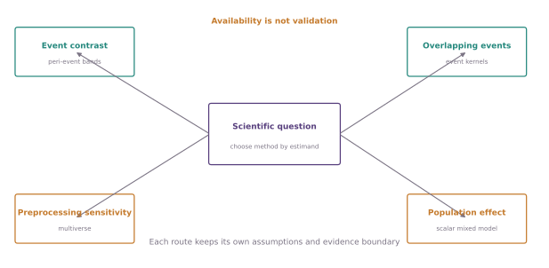

# Choose a method

fipha is organized around the scientific question, not the name of an
algorithm. Choose the row that describes what you want to learn; each category
then separates supported workflows, experimental workflows, and known gaps.

<figure class="doc-figure doc-figure--wide">
  
  <figcaption><strong>Start with the estimand.</strong> Acquisition and quality checks precede every route; population inference and robustness apply across routes rather than replacing them.</figcaption>
</figure>

| Your question | Start here | Typical output |
|---|---|---|
| Is the fluorescence trace technically and biologically interpretable? | [Signal formation and validity](signal-validity.md) | corrected signal, QC ledger, validity status |
| What happens around an event, or what does each overlapping event explain? | [Event-locked responses and encoding](event-locked.md) | peri-event contrast or held-out encoding kernel |
| What events, rhythms, or states occur without a supplied event clock? | [Spontaneous and continuous dynamics](continuous-dynamics.md) | transient ledger, PSD, autocorrelation, spectrogram, state contrast |
| How do sites, colors, or spatially arranged fibers relate? | [Multi-signal and spatial analysis](multisignal-spatial.md) | association, coherence, crosstalk review, spatial summary |
| Does an effect generalize across animals and analytic choices? | [Population inference and robustness](inference-robustness.md) | animal-level interval, mixed-model sensitivity, multiverse ledger |
| How do pose, behavior, sessions, and learning trajectories connect? | [Behavior and longitudinal integration](behavior-longitudinal.md) | synchronized annotations, comparable session summaries, Unspool handoff |

## Two maps with different jobs

- The [capability and gap matrix](capability-matrix.md) is the coverage audit. It
  states what is supported, experimental, external, or absent.
- The [public-data evidence atlas](public-evidence-atlas.md) is the validation
  audit. It shows which claims have public-data evidence and retains negative
  results.

Method availability is not evidence of scientific validity. Every empirical page
must identify the experimental unit, uncertainty denominator, assumptions, and
the strongest claim its evidence permits.

## Cross-cutting rules

1. Preserve acquisition clocks, gaps, channels, and annotation provenance.
2. Separate signal construction from the scientific outcome.
3. Hold out complete animals or sessions when evaluating prediction.
4. Aggregate repeated measurements before population inference.
5. Name defensible alternatives and retain failed workflows.
6. Treat figures, tables, and machine-readable artifacts as views of the same
   versioned result.
