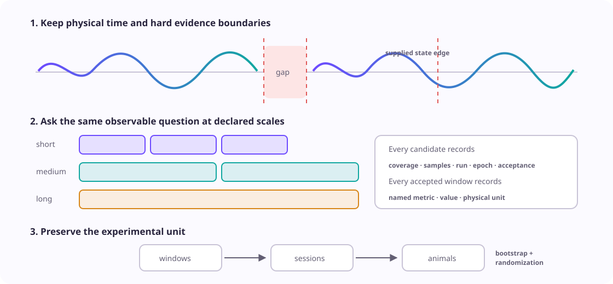

# Multiscale summaries for long recordings

Use this workflow when the question is how a processed photometry signal changes
over seconds, minutes, or longer periods, and no single event defines the analysis.
It emits observable window summaries; it does **not** infer a biological “tonic” or
“phasic” component from window length.

This is an **experimental product API**. It accepts irregular timestamps in
physical time, keeps gaps and supplied state epochs as hard boundaries, exposes
every window denominator, and carries one chosen summary through session-to-animal
inference.

<figure class="doc-figure doc-figure--wide">
  
  <figcaption><strong>Scales describe observation windows, not biology.</strong> Every candidate window retains coverage and acceptance evidence. Inferential comparisons aggregate windows within sessions and sessions within animals before resampling animals.</figcaption>
</figure>

## What is available

| Need | Public contract | Evidence retained |
| --- | --- | --- |
| Several physical-time scales | `MultiscaleWindowSpec` | name, duration, step, minimum coverage and samples |
| Gap-aware, optionally state-conditioned summaries | `summarize_multiscale` | continuity runs, epoch identity, accepted and rejected windows |
| Irregular-sampling-aware location and spread | `time_weighted_*` metrics | trapezoidal physical-time integration and observed duration |
| Familiar sample descriptions | `sample_*` metrics | explicit sample weighting and sample count |
| Animal-level condition contrasts | `infer_multiscale_animals` | window→session→animal ledger, interval and randomization test |

## Declare scales and observables

```python
from fiberphotometry import (
    MultiscaleContinuitySpec,
    MultiscaleSummarySpec,
    MultiscaleWindowSpec,
    summarize_multiscale,
)

summary_spec = MultiscaleSummarySpec(
    windows=(
        MultiscaleWindowSpec(
            "ten_seconds",
            duration_s=10,
            step_s=5,  # 50% overlap is explicit
            minimum_coverage=0.95,
            minimum_samples=20,
        ),
        MultiscaleWindowSpec(
            "five_minutes",
            duration_s=300,
            step_s=300,  # non-overlapping
            minimum_coverage=0.98,
            minimum_samples=300,
        ),
    ),
    metrics=(
        "time_weighted_mean",
        "time_weighted_standard_deviation",
        "sample_median",
        "sample_iqr",
        "sample_linear_slope",
    ),
    continuity=MultiscaleContinuitySpec(
        gap_factor=3,
        maximum_gap_s=None,
    ),
)

result = summarize_multiscale(
    time_s,
    processed_signal,
    summary_spec,
    valid=valid_samples,
    value_unit="dF/F",
)
```

When `step_s` is omitted, it equals `duration_s`. A smaller step creates
overlapping estimates; a larger step intentionally leaves unsummarized time. The
window duration remains the coverage denominator even at a recording edge, so an
incomplete final window is not made to look complete by shortening its target.

## Choose weighting deliberately

The metric name says what receives equal weight:

| Metric | Calculation | Unit |
| --- | --- | --- |
| `time_weighted_mean` | trapezoidal integral divided by observed seconds | signal unit |
| `time_weighted_standard_deviation` | physical-time weighted variation around the time-weighted mean | signal unit |
| `time_weighted_rms` | physical-time weighted root mean square | signal unit |
| `sample_mean`, `sample_median` | each acquired sample has equal weight | signal unit |
| `sample_standard_deviation`, `sample_iqr`, `sample_rms` | sample-weighted spread or magnitude | signal unit |
| `sample_linear_slope` | least-squares signal change per clock second | signal unit/s |

Time-weighted metrics linearly interpolate only between adjacent observations
inside one continuity run. They do not interpolate across a missing sample,
acquisition gap, or state boundary. Sample metrics remain useful after prospective
regularization or when matching a published sample-based estimand, but their names
prevent an irregular clock from silently changing temporal weighting.

## Inspect acceptance before values

```python
accepted = [window for window in result.windows if window.accepted]
rejected = [window for window in result.windows if not window.accepted]

for window in rejected[:5]:
    print(
        window.scale,
        window.coverage_fraction,
        window.sample_count,
        window.exclusion_reason,
    )

for run in result.runs:
    print(run.run_id, run.state, run.epoch_id, run.interval_cv)
```

Each `MultiscaleEstimate` points back to one `window_id`. The corresponding
`MultiscaleWindowRecord` supplies the run, physical bounds, sample count, observed
duration, coverage, and acceptance decision. Rejected candidates remain in the
ledger but produce no estimate. Isolated valid segments with fewer than two
samples remain in `run_exclusions`, because they cannot support physical-time
integration. `evidence_fingerprint` binds the signal, validity, epochs, units,
scales, metrics, and continuity policy.

## Condition on externally supplied states

```python
from fiberphotometry import StateEpoch

epochs = (
    StateEpoch("exploration", 12.0, 48.5, epoch_id="bout-001"),
    StateEpoch("rest", 55.0, 91.0, epoch_id="bout-002"),
)

by_state = summarize_multiscale(
    time_s,
    processed_signal,
    summary_spec,
    valid=valid_samples,
    epochs=epochs,
    value_unit="dF/F",
)
```

Epochs are half-open and may not overlap. Equal state labels in separate epochs
remain separate continuity runs. Samples outside supplied epochs are counted in
`unassigned_valid_sample_count`; the package does not discover or fill state.

## Compare conditions across animals

Attach identity only after each session has been summarized:

```python
from fiberphotometry import (
    MultiscaleAnimalInferenceSpec,
    MultiscaleStudySession,
    infer_multiscale_animals,
)

sessions = [
    MultiscaleStudySession(
        subject="mouse-01",
        session="day-01",
        condition="vehicle",
        result=mouse_01_day_01,
    ),
    # More independently acquired sessions and animals...
]

contrast = infer_multiscale_animals(
    sessions,
    MultiscaleAnimalInferenceSpec(
        scale="five_minutes",
        metric="time_weighted_mean",
        condition_a="vehicle",
        condition_b="drug",
        state="rest",  # use None for an unconditioned result
        design="paired",
        effect_scale="difference",
        window_aggregation="median",
        session_aggregation="median",
        seed=2026,
    ),
)
```

The reported difference is condition B minus condition A; a ratio is B/A. Windows
are aggregated within each session, then sessions receive equal weight within each
animal. Bootstrap samples and paired swaps or independent-label permutations act
on animals. `summed_window_observed_duration_s` is an evidence total and can exceed
recording duration when windows overlap; it is never treated as the number of
independent replicates.

## Relationship to the rest of the toolkit

- Use [spontaneous-transient analysis](spontaneous-transients-v0.1.md) when the
  estimand is event rate, amplitude, width, or area.
- Use [time, frequency, and state analysis](spectral-state-analysis-v0.1.md) for
  autocorrelation, PSD, spectrograms, coherence, or band power. Fourier methods
  require a regular clock; physical-time multiscale integration does not.
- Run [across-session comparability](session-comparability-v0.1.md) before treating
  a change in scale summaries as longitudinal biology.
- Pass declared, comparable session summaries to
  [Unspool](unspool-interoperability-v0.1.md) for learning trajectories rather than
  rebuilding behavioral longitudinal models here.

## Boundaries and open validation

This workflow does not estimate a latent baseline, deconvolve sensor kinetics,
identify sustained neurotransmitter release, discover states, or choose a
biologically privileged scale. Absolute mean and slope can remain sensitive to
bleaching, motion, hemodynamics, reference correction, and session-to-session
scale changes. Reasonable scales and weighting choices therefore belong in a
named multiverse when the conclusion depends on them.

The API is experimental until it has raw-signal and annotation validation across
multiple sensors and acquisition systems. See
[SDR-0051](decisions/0051-name-observable-multiscale-estimands-and-preserve-denominators.md)
for the decision and alternatives.
