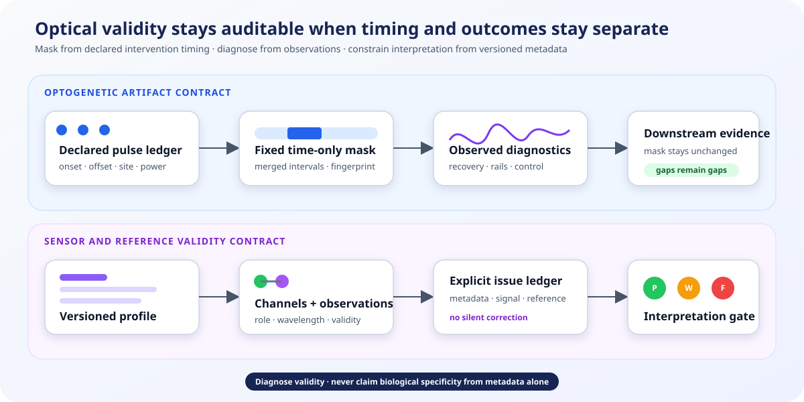

# Optogenetic artifacts and sensor validity

Optical experiments need two safeguards that answer different questions:

1. **Which samples were prospectively excluded because stimulation occurred?**
2. **Does the recorded optical evidence support the intended interpretation?**

FiberPhotometry keeps those questions separate. A pulse-derived mask cannot expand or
shrink after the signal is inspected, while recovery, saturation, wavelength, and
reference-channel diagnostics remain visible evidence alongside the analysis.

<figure class="doc-figure doc-figure--wide">
  
  <figcaption><strong>Two contracts, no circular masking.</strong> Stimulation times determine exclusions; observed optical data determine warnings. A versioned sensor profile constrains interpretation without pretending to prove biological specificity.</figcaption>
</figure>

Both APIs are **experimental**. They provide operational safeguards and provenance,
not automatic artifact correction, hemodynamic correction, spectral unmixing,
deconvolution, or concentration calibration.

## Build a prospective stimulation mask

Declare pulses in the same clock as the photometry samples, then choose the fixed
pre/post exclusion policy before inspecting outcomes:

```python
from fiberphotometry import (
    OptogeneticMaskSpec,
    StimulationPulse,
    build_optogenetic_artifact_mask,
)

pulses = (
    StimulationPulse(
        pulse_id="train-001",
        onset_s=42.0,
        offset_s=42.5,
        site="VTA",
        wavelength_nm=473,
        power_mw=5,
    ),
)

mask = build_optogenetic_artifact_mask(
    recording.time,
    pulses,
    OptogeneticMaskSpec(pre_pulse_s=0.01, post_pulse_s=0.20),
    existing_valid=recording.valid,
)
```

The result retains the complete pulse ledger, merged exclusion intervals, original
and newly invalid sample counts, the retained denominator, and a deterministic
fingerprint. Overlapping expanded pulse intervals are merged without losing their
pulse IDs. Existing invalidity is composed with the artifact mask; timestamps are
never compressed.

`mask.valid_array` can be passed directly to downstream APIs that accept a `valid`
mask, including `welch_psd`, `spectrogram`, and the paired-signal functions. This
means an optogenetic exclusion becomes an ordinary continuity boundary: spectral
windows, lag pairs, and state summaries cannot bridge it.

## Diagnose recovery without changing the mask

Observed recovery is useful, but allowing it to determine the exclusion would make
the analyzed denominator depend on the outcome. Run it as a separate assessment:

```python
from fiberphotometry import (
    OptogeneticRecoverySpec,
    assess_optogenetic_artifacts,
)

assessment = assess_optogenetic_artifacts(
    recording.time,
    recording.signal,
    pulses,
    OptogeneticRecoverySpec(
        baseline_duration_s=0.5,
        assessment_duration_s=1.0,
        recovery_threshold_sd=3.0,
        stable_duration_s=0.05,
        detector_floor=-1.0,
        detector_ceiling=1.0,
    ),
    valid=recording.valid,
    negative_control=fluorophore_negative_control,
    negative_control_name="fluorophore-negative-control",
)
```

For every pulse the assessment records robust baseline location/scale, peak
deviation, recovery time, required stable-sample count, detector saturation, and
optional negative-control behavior. Closely spaced pulses explicitly censor the
first recovery window and flag a subsequent contaminated baseline. Important
warnings include:

- `recovery_censored_by_next_pulse`;
- `baseline_overlaps_previous_pulse`;
- `not_recovered_in_window`;
- `detector_saturation_during_assessment`; and
- `large_negative_control_artifact`.

These observations may justify a new **prospective** mask specification in a later
study or sensitivity universe. They never mutate the current mask.

## Declare a versioned sensor profile

Sensor metadata evolves, varies by construct and preparation, and is often
context-specific. The package therefore provides an open registry rather than a
closed enum or a silently updated table of built-in sensor facts.

```python
from fiberphotometry import (
    SensorKinetics,
    SensorProfile,
    SensorRegistry,
    WavelengthRange,
)

profile = SensorProfile(
    profile_id="my-lab-dlight13b",
    sensor_name="dLight1.3b",
    profile_version="2026-07-27",
    signal_excitation_nm=WavelengthRange(465, 475),
    emission_nm=WavelengthRange(510, 540),
    isosbestic_excitation_nm=WavelengthRange(405, 415),
    interpretation="reports fluorescence change, not dopamine concentration",
    evidence_source="DOI, protocol version, or lab calibration record",
    kinetics=SensorKinetics(
        rise_time_s=0.05,
        decay_time_s=0.40,
        measurement_context="bench characterization",
        evidence_source="DOI or calibration record",
    ),
    linear_response_range=(-3.0, 3.0),
    linear_response_unit="dF/F",
    constraints=("do not infer sub-50-ms dynamics",),
    metadata=(("construct", "dLight1.3b"),),
)

registry = SensorRegistry().with_profile(profile)
profile = registry.resolve("my-lab-dlight13b", "2026-07-27")
```

Every profile version is immutable. If a registry contains multiple versions,
resolution without an explicit version fails instead of selecting the newest one.
New evidence should create a new profile version; old analyses retain their original
interpretation contract.

## Assess the recorded channels

Pair the profile with explicit channel identity and preprocessing provenance:

```python
from fiberphotometry import (
    ChannelIdentity,
    SensorChannelAssignment,
    SensorValiditySpec,
    assess_sensor_validity,
)

signal_channel = ChannelIdentity(
    "dms-signal", "DMS", "dLight1.3b", "sensor", "dF/F",
    excitation_wavelength_nm=470,
    emission_wavelength_nm=525,
    detector_id="detector-1",
    fiber_id="fiber-1",
)
reference_channel = ChannelIdentity(
    "dms-reference", "DMS", "dLight1.3b", "isosbestic", "dF/F",
    excitation_wavelength_nm=410,
    emission_wavelength_nm=525,
    detector_id="detector-1",
    fiber_id="fiber-1",
)
assignment = SensorChannelAssignment(
    subject="mouse-01",
    session="session-01",
    signal=signal_channel,
    reference=reference_channel,
    clock_id="photometry-clock",
    alignment_policy="native_shared_clock",
    preprocessing_fingerprint="sha256:...",
)

validity = assess_sensor_validity(
    time,
    signal,
    assignment,
    profile,
    SensorValiditySpec(detector_floor=-1.0, detector_ceiling=1.0),
    reference_values=reference,
    signal_valid=signal_valid,
    reference_valid=reference_valid,
    event_times=events,
)
```

The assessment checks declared role, sensor, excitation/emission ranges, detector,
fiber, units, finite support, repeated extrema, flat steps, saturation, and any
declared linear range. With a reference channel it also reports shared valid support,
signal/reference variance and correlation, derivative lag evidence, and event-
correlated reference responses. Gap handling is inherited from the same continuity
contract used by the spectral and multisignal APIs.

`status` is `pass`, `warning`, or `fail`; every non-pass state retains machine-
readable issue codes. `require_ready()` can enforce the result at an application
boundary. The JSON output retains the exact profile, assignment, thresholds,
metrics, issues, and interpretation constraints.

## What the assessment cannot establish

A matching excitation range does not prove that a channel is isosbestic in vivo.
A quiet reference does not prove absence of hemodynamics or movement. Correlation
does not establish contamination, and kinetics measured in one preparation need not
transfer to another. Detector rails must come from the acquisition system; package
defaults cannot infer them from the observed extrema without circularity.

For those reasons this layer diagnoses validity and constrains interpretation. It
does not automatically regress the reference, lengthen pulse masks, unmix spectra,
or convert fluorescence to analyte concentration.

## Current product boundary

| Available now | Still a deliberate gap |
|---|---|
| Fixed time-only pulse masks with fingerprints | Data-adaptive artifact-mask expansion |
| Pulse recovery, censoring, saturation, and negative-control evidence | Automatic optogenetic artifact interpolation or subtraction |
| Open, versioned sensor profiles | Package-maintained authoritative sensor database |
| Wavelength, detector, fiber, role, and unit checks | Wavelength-aware hemodynamic correction and spectral unmixing |
| Gap-aware isosbestic association, lag, and event diagnostics | Proof of biological inertness or concentration calibration |
| Pass/warning/fail gates with JSON provenance | Validated sensor-specific deconvolution |

See [SDR-0047](decisions/0047-separate-prospective-optical-masks-from-observed-validity.md)
for the decision boundary and the [capability matrix](methods/capability-matrix.md)
for adjacent roadmap gaps.
