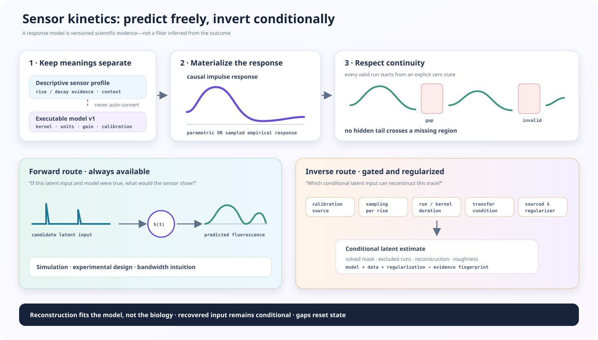

# Sensor-kinetic forward models and guarded deconvolution

Use this experimental workflow to ask how a declared sensor response transforms a
latent input, whether the acquisition could resolve that model, and—only after
those checks—what regularized latent input is consistent with an observed trace.

It does **not** turn fluorescence into ground-truth neurotransmitter concentration.
Every inverse result is conditional on one versioned response model, calibration
source, sampling grid, run-boundary assumption, baseline policy and regularization
choice.

<figure class="doc-figure doc-figure--wide">
  
  <figcaption><strong>Forward is a model consequence; inverse is an assumption-sensitive estimate.</strong> Gaps reset state in both directions. A good reconstruction shows that the regularized estimate reproduces the observed signal under the declared model—it does not establish that the model is biologically correct.</figcaption>
</figure>

## Keep descriptive kinetics separate from an executable model

`SensorKinetics` in a
[versioned sensor profile](optical-validity-v0.1.md#declare-a-versioned-sensor-profile)
records context-specific rise and decay evidence. It deliberately does not say
whether reported values are time constants, 10–90% times, pulse durations,
single-exponential fits or in-vivo impulse responses.

Executable models therefore require a separate identity:

```python
from fiberphotometry import KineticModelIdentity

identity = KineticModelIdentity(
    model_id="lab-dlight13b-pulse-response",
    model_version="1",
    sensor_profile_id="my-lab-dlight13b",
    sensor_profile_version="2026-07-27",
    input_quantity="latent dopamine drive",
    input_unit="calibration a.u.",
    output_unit="dF/F",
    measurement_context="bench pulse calibration",
    evidence_source="calibration protocol and frozen result checksum",
    coefficient_source="independently_calibrated",
    calibration_id="dlight13b-batch-2026-07",
)
```

An independently calibrated identity requires a calibration ID. Set
`coefficient_source="user_declared"` for a sensitivity model; it is retained as a
warning and can be made a hard refusal at the deconvolution gate.

The input name and unit describe the calibration model's latent variable. They do
not acquire stronger biological meaning when the model is inverted. Use an
arbitrary or calibration unit unless an independent concentration calibration
actually identifies the gain and response in the relevant preparation.

## Choose a causal response family

### Difference of exponentials

```python
from fiberphotometry import DifferenceOfExponentialsModel

model = DifferenceOfExponentialsModel(
    identity=identity,
    rise_time_constant_s=0.10,
    decay_time_constant_s=0.50,
    gain=1.0,
    latency_s=0.0,
    tail_fraction=1e-4,
)
```

This is a causal linear time-invariant sensitivity model. The rise constant must
be shorter than the decay constant. Its kernel is normalized to unit area before
the declared gain is applied, so a sustained unit input approaches the declared
steady-state gain after boundary effects have passed.

Do not copy a profile's descriptive rise and decay numbers into these fields
unless the evidence defines them as the corresponding model time constants.

### Sampled empirical response

```python
from fiberphotometry import SampledImpulseResponseModel

model = SampledImpulseResponseModel(
    identity=identity,
    sample_interval_s=0.01,
    response_density=tuple(calibrated_impulse_response),
    normalization="unit_area",
    gain=calibrated_gain,
)
```

This boundary supports an empirical response, an external simulator, or a future
model family without forcing it into the two-exponential shape. The supplied
values are a causal response density beginning at time zero. They are linearly
interpolated onto the recording interval. `unit_area` separates shape from gain;
`as_supplied` preserves the response integral exactly.

`kinetic_kernel(model, sampling_interval_s)` materializes the exact density and
discrete convolution weights used by either route, including integral, peak time
and finite support.

## Run the forward model first

```python
from fiberphotometry import KineticForwardSpec, predict_sensor_response

prediction = predict_sensor_response(
    time_s,
    candidate_latent_input,
    model,
    KineticForwardSpec(),
    valid=latent_valid,
)
```

Forward prediction is the easier and usually more defensible question: “If this
latent input and model were true, what output would be observed?” It is useful for
simulation, experimental-design checks and testing whether proposed biological
dynamics survive the sensor's bandwidth.

Timestamp gaps, invalid input and non-finite samples split continuity runs. Each
run begins with a declared zero model state. No tail is carried across a gap.
`boundary_affected_sample_count` makes the samples whose prediction depends on
that zero-state assumption visible; they are not silently presented as steady
state.

## Assess identifiability before looking at the inverse

```python
from fiberphotometry import (
    KineticDeconvolutionSpec,
    assess_kinetic_identifiability,
)

inverse_spec = KineticDeconvolutionSpec(
    regularization_strength=1e-4,
    regularization_source="held-out calibration reconstruction",
    smoothness_order=1,
    nonnegative=True,
    fit_run_baseline=True,
    minimum_samples_per_rise=3,
    minimum_run_to_kernel_ratio=2,
    require_independent_calibration=True,
)

assessment = assess_kinetic_identifiability(
    time_s,
    model,
    inverse_spec,
    valid=signal_valid,
)
assessment.require_ready()
```

This assessment is outcome-blind. It checks:

- whether coefficients are independently calibrated or user-declared;
- samples per rise time constant for the parametric model;
- each uninterrupted run's duration relative to kernel support;
- the unregularized and regularized transfer condition numbers;
- the frequency range retaining the declared fraction of maximum transfer; and
- the maximum gain of the selected regularized inverse filter.

Under-sampled rise dynamics, an unresolved transfer nullspace, an excessive
regularized condition number, or no eligible run produces `status="fail"`.
Short individual runs and an assumed model remain explicit warnings. Supplying a
positive regularization value is mandatory: an unregularized inverse is not an
available accidental default.

Transfer diagnostics describe numerical recoverability under the model. They do
not measure in-vivo noise, model mismatch, motion, hemodynamics or saturation.
Run [sensor and reference validity](optical-validity-v0.1.md) and any relevant
[optical unmixing](optical-unmixing-v0.1.md) before this stage.

## Estimate a conditional latent input

```python
from fiberphotometry import deconvolve_sensor_response

result = deconvolve_sensor_response(
    time_s,
    observed_dff,
    model,
    inverse_spec,
    valid=signal_valid,
)
```

The solver minimizes reconstruction error plus the declared zeroth-, first- or
second-order penalty. `nonnegative=True` applies a nonnegative bound to the latent
input while leaving each run's optional baseline unconstrained.

Each eligible continuity run is solved independently. The result retains:

- the latent estimate and reconstructed output on the original timestamp grid;
- a `solved` mask, with excluded runs left `NaN` rather than interpolated;
- fitted run baseline, RMSE, R² and reconstruction correlation;
- latent roughness, lower-bound activity and solver iterations;
- kernel-boundary exposure for every solved run;
- the complete identifiability assessment; and
- an evidence fingerprint binding data, masks, model and inverse specification.

High reconstruction R² is necessary but weak evidence: a flexible regularized
inverse can reconstruct data under a misspecified kernel. It is not a model
validation statistic and is not an uncertainty interval.

## Treat regularization as a robustness choice

Regularization controls the scientific answer. A small value may amplify noise
and create narrow events; a large value may merge events and attenuate amplitude.
The package therefore requires a named `regularization_source` and binds the value
into the evidence fingerprint.

Prefer a value frozen from independent calibration or simulation. When several
values remain defensible, run named specifications and report whether timing,
integrated input and condition contrasts survive the set. Do not choose the value
that makes the biological result most attractive. A typed cross-regularization
summary and calibrated latent uncertainty remain roadmap work.

## Current claim boundary

Available now:

- versioned calibrated or user-declared model identity;
- parametric and sampled causal linear response families;
- gap-bounded forward prediction with boundary evidence;
- outcome-blind sampling, duration and transfer diagnostics; and
- regularized unconstrained or nonnegative inversion with full reconstruction
  evidence.

Still deliberately unresolved:

- nonlinear binding, saturation, bleaching or time-varying kinetics;
- automatic conversion from descriptive sensor-profile kinetics;
- automatic regularization selection from the biological outcome;
- calibrated latent-input uncertainty;
- universal sensor coefficients supplied by the package; and
- concentration claims without an independent preparation-relevant calibration.

The decision is recorded in
[SDR-0054](decisions/0054-make-forward-models-primary-and-deconvolution-conditional.md).
