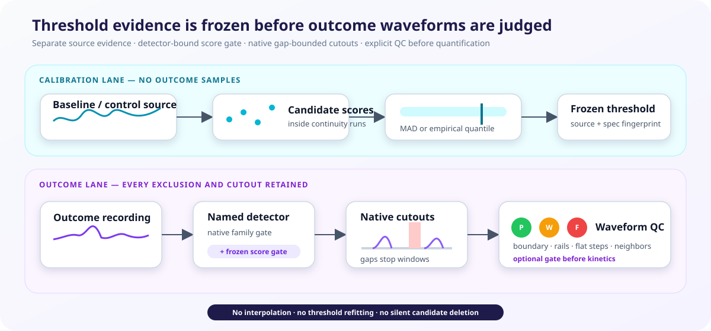

# Spontaneous transients and long recordings

!!! warning "Experimental method family"

    There is no field-wide spontaneous-event definition. Report the complete
    specification and show whether conclusions survive plausible alternatives.

<figure class="doc-figure doc-figure--wide">
  
  <figcaption><strong>Threshold learning and outcome analysis stay separate.</strong> Frozen source evidence adds a detector-score gate; native cutouts retain boundary, rail, flat-step, and neighboring-event evidence before kinetics are quantified.</figcaption>
</figure>

The preferred product API separates candidate detection from kinetic
quantification. This matters whenever detection uses a normalized representation:
candidate timestamps can come from a z-scored stream while amplitude, width, and
area are measured on non-z-scored dF/F.

```python
from fiberphotometry import (
    ProminenceTransientDetectorSpec,
    TransientQuantificationSpec,
    detect_transient_candidates,
    quantify_transient_candidates,
)

candidates = detect_transient_candidates(
    recording,
    variable="detection_z",
    spec=ProminenceTransientDetectorSpec(
        minimum_height_z=1,
        minimum_prominence_z=2,
        detrend_window_s=100,
    ),
)
result = quantify_transient_candidates(
    recording,
    candidates,
    variable="dff",
    spec=TransientQuantificationSpec(
        baseline_method="mean",
        baseline_start_s=1.0,
        baseline_end_s=0.2,
    ),
)
```

Both stages split the signal at missing acquisition and large timestamp gaps.
Candidate IDs retain the detector family, sample, threshold, and score through
quantification.

## Freeze a threshold from baseline or control evidence

Threshold calibration consumes a separate recording containing explicitly
designated baseline or negative-control evidence. It extracts candidate-scale peak
scores inside uninterrupted runs and produces an immutable threshold for every
channel:

```python
from fiberphotometry import (
    ProminenceTransientDetectorSpec,
    TransientThresholdCalibrationSpec,
    calibrate_transient_thresholds,
)

detector_spec = ProminenceTransientDetectorSpec(
    minimum_height_z=1,
    minimum_prominence_z=2,
    detrend_window_s=100,
)
frozen = calibrate_transient_thresholds(
    negative_control_recording,
    variable="detection_z",
    detector_spec=detector_spec,
    source_role="negative_control",
    source_id="fluorophore-negative-control-01",
    preprocessing_fingerprint="sha256:...",
    calibration_spec=TransientThresholdCalibrationSpec(
        estimator="empirical_quantile",
        quantile=0.999,
        minimum_score_count=100,
    ),
)

candidates = detect_transient_candidates(
    outcome_recording,
    variable="detection_z",
    spec=detector_spec,
    frozen_thresholds=frozen,
)
```

The frozen object binds the thresholds to the exact detector dataclass, detector
variable, ordered channels, source role and ID, preprocessing fingerprint, estimator,
and calibration denominator. Reusing it with a changed detector specification,
variable, or channel layout fails. The calibration fingerprint changes if source
samples or any part of that contract changes.

Two estimators are explicit alternatives:

- `median_mad` uses the median candidate score plus a declared robust-MAD
  multiplier;
- `empirical_quantile` uses a declared quantile of the source score distribution.

PASTa and GuPPY candidate scores are amplitudes above their family-specific
baselines; prominence-family scores are gap-local z-scale prominences. The frozen
value is an **additional score gate**. Each family's native threshold still applies,
and sub-threshold local maxima remain in `exclusions` with observed and required
scores. Calibration does not decide which estimator or source is scientifically
correct; those belong in the prospective analysis specification and robustness
workflow.

## Cut and review candidate waveforms

Cutouts retain native samples and stop at missing acquisition, timestamp gaps, and
recording boundaries. They are never interpolated onto a synthetic time grid:

```python
from fiberphotometry import TransientWaveformSpec, cut_transient_waveforms

waveforms = cut_transient_waveforms(
    outcome_recording,
    candidates,
    variable="dff",
    spec=TransientWaveformSpec(
        pre_peak_s=1.0,
        post_peak_s=2.0,
        require_complete_window=True,
        detector_floor=-1.0,
        detector_ceiling=1.0,
    ),
)

result = quantify_transient_candidates(
    outcome_recording,
    candidates,
    variable="dff",
    spec=TransientQuantificationSpec(
        require_waveform_qc=True,
        allow_waveform_warnings=True,
    ),
    waveforms=waveforms,
)
```

Every candidate keeps its cutout even when QC fails. Each waveform reports requested
and observed bounds, pre/post coverage, baseline median/SD/slope, exact repeated-step
fraction, optional detector-rail fraction, nearby candidate IDs, issue codes, and a
`pass`, `warning`, or `fail` status. Default failures include incomplete required
windows, excessive detector saturation, and long repeated plateaus. A nearby event is
a warning because the cutout is not an isolated-event waveform.

`waveforms.to_xarray()` pads ragged native cutouts for plotting while retaining a
two-dimensional native relative-time array and presence mask; it does not interpolate.
When `require_waveform_qc=True`, failed candidates are retained as explicit
`waveform_qc_failed` quantification exclusions. Warning-bearing cutouts remain eligible
by default, or can be refused prospectively with `allow_waveform_warnings=False`.

## Named detector families

- `PastaTransientDetectorSpec` finds local maxima and tests their amplitude
  relative to a pre-peak mean, minimum, or last local minimum. Its threshold is
  supplied in the same units as the detection stream.
- `GuppyTransientDetectorSpec` implements GuPPY's chunked two-threshold
  procedure: high-amplitude samples are excluded using the first, unscaled MAD
  threshold before the second MAD threshold and local-maximum detection.
- `ProminenceTransientDetectorSpec` optionally removes a gap-local moving mean,
  z-scores within each uninterrupted run, and requires both peak height and
  prominence. Quantification remains a separate call on dF/F.

These are compatibility families, not assertions that one detector is correct.
The exact specification belongs in analysis provenance.

## Legacy combined call

`detect_transients()` remains available for the earlier single-variable workflow:

```python
from fiberphotometry import TransientDetectionSpec, detect_transients

result = detect_transients(
    recording,
    variable="dff",
    spec=TransientDetectionSpec(
        threshold_mode="rolling_mad",
        threshold=3.0,
        noise_window_s=15.0,
        baseline_duration_s=0.9,
        baseline_gap_s=0.1,
        baseline_statistic="median",
        minimum_distance_s=0.2,
        bin_width_s=30.0,
    ),
)
```

## What the outputs mean

- `events` contains peak time, local baseline, amplitude, half-height rise/fall
  timing and width, AUC, and preceding inter-event interval.
- `exclusions` records insufficient baselines, sub-threshold candidates, and
  shapes truncated by acquisition boundaries or gaps.
- `summaries` reports count, rate, and median event properties per channel.
- `bins` provides count, finite exposure, exposure-adjusted rate, and median
  amplitude in long windows.

The bins are descriptive. They are not called a tonic signal: slow fluorescence
variation may combine biology with bleaching, motion, and sensor kinetics.

## A minimum sensitivity analysis

At minimum, compare `global_mad` and `rolling_mad`, more than one defensible MAD
multiplier, and `median` versus `minimum` local baselines. The scientific result
should include changes in event count as well as downstream effect estimates.

For new work, prefer the separated calls. Do not use a z-scored quantification
variable to claim interpretable changes in amplitude or kinetics across
conditions.

## Current boundaries

Quantification marks nearby events with compound-group/rank metadata, accepts frozen
baseline/control score gates, and can require gap-aware waveform QC. These safeguards
do not establish that detected fluorescence peaks are neurotransmitter-release events,
choose a universally valid threshold source, deconvolve sensor kinetics, or resolve
overlapping compound events into latent components.

See [SDR-0048](decisions/0048-freeze-transient-thresholds-and-retain-waveform-qc.md)
for the decision boundary.

## Animal-level rate and kinetic contrasts

Attach subject, session, and condition identity to each quantified result, then
declare a paired or independent contrast:

```python
from fiberphotometry import (
    TransientAnimalInferenceSpec,
    TransientStudySession,
    infer_transient_animals,
)

study = [
    TransientStudySession(
        subject="mouse-01",
        session="day-1",
        condition="control",
        result=control_result,
    ),
    TransientStudySession(
        subject="mouse-01",
        session="day-2",
        condition="drug",
        result=drug_result,
    ),
    # Additional animals...
]
inference = infer_transient_animals(
    study,
    TransientAnimalInferenceSpec(
        metric="rate_per_minute",  # or amplitude, width_s, auc
        condition_a="control",
        condition_b="drug",
        channel="NAc",
        design="paired",
        effect_scale="difference",
        seed=2026,
    ),
)
```

Rates pool event counts over acquired exposure within each animal-condition.
Kinetic metrics are summarized within session and then within animal. Bootstrap
intervals resample animals; permutation evidence swaps conditions within paired
animals or shuffles whole-animal estimates in independent designs. The result
retains every animal estimate and reports incomplete paired animals explicitly.

This API does not deconvolve sensor kinetics, assign events to neurotransmitter
release episodes, or infer a biological tonic/phasic decomposition.

## Sources

- Donka et al., [PASTa: flexible photometry analysis including spontaneous
  transients](https://pmc.ncbi.nlm.nih.gov/articles/PMC12224222/)
- Sherathiya et al., [GuPPy: a Python toolbox for fiber photometry
  analysis](https://pmc.ncbi.nlm.nih.gov/articles/PMC8688475/)
- Wallace et al., [The z-scored data are not the data](https://pmc.ncbi.nlm.nih.gov/articles/PMC13245556/)
- Markowitz et al., [Wideband dopamine dynamics](https://pmc.ncbi.nlm.nih.gov/articles/PMC11526850/)
