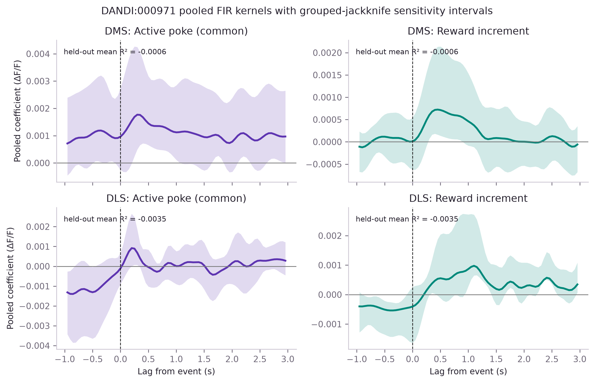

# Public behavioral event-kernel reanalysis

!!! warning "Experimental result with weak held-out prediction"
    The workflow executed correctly, but the declared events did not predict a
    completely held-out animal better than its mean response on average. The
    pooled kernels are descriptive and must not be read without that result.

## Scientific question

Can overlapping action and reward responses be separated in continuous DMS and
DLS photometry while testing whether the model generalizes to animals excluded
from fitting?

This example uses Seiler et al.'s public recordings from
[DANDI:000971](https://doi.org/10.48324/dandi.000971/0.260213.1851). The source
study examined dopamine signaling during rewarded and unrewarded active nose
pokes and its relationship to compulsive behavior
([Seiler et al., 2022](https://doi.org/10.1016/j.cub.2022.01.055)). Our narrower
reanalysis tests the product's continuous encoding workflow. It is an **adapted
reanalysis**, not a source-panel reproduction: the joint regularized kernel and
complete-animal held-out prediction were not source-paper analyses. See the
[paper-figure correspondence register](paper-figure-roadmap.md).

## Why two event predictors?

Every reward timestamp is exactly one active-poke timestamp. Treating “rewarded
poke” and “all pokes” as unrelated event trains would obscure their relationship.
The joint model instead defines:

- **active poke:** the kernel common to all active pokes, interpretable as the
  pooled unrewarded-poke response;
- **reward increment:** the additional kernel on rewarded pokes, conditional on
  the common active-poke response.

Both use a −1 to +3 second FIR window. DMS and DLS are fitted separately after the
same 3-Hz zero-phase filtering and robust fitted-reference dF/F correction used in
the earlier public-data tutorial. The model sees complete recordings, not only
selected event windows.

## Cohort and denominator

The checksum-pinned cohort contains one session from each of six animals:

| Animal | Family | Active pokes | Rewarded | Unrewarded | 20-Hz observations |
|---|---|---:|---:|---:|---:|
| 028-392 | PR | 87 | 32 | 55 | 76,980 |
| 048-392 | PR | 124 | 25 | 99 | 74,375 |
| 272-396 | DPR | 149 | 39 | 110 | 74,368 |
| 333-393 | DPR | 246 | 49 | 197 | 72,852 |
| 112-283 | PS | 42 | 7 | 35 | 73,760 |
| 113-283 | PS | 311 | 48 | 263 | 81,423 |

There are 959 active pokes, of which 200 are rewarded, across 453,758 continuous
samples. The independent validation denominator remains six animals.

## Frozen model and result

The [model protocol](https://github.com/aeronjl/fiberphotometry/blob/main/benchmarks/protocol-dandi-000971-event-kernel-v0.1.md)
was committed before the original model outcomes were inspected. The separate
[uncertainty and diagnostics protocol](https://github.com/aeronjl/fiberphotometry/blob/main/benchmarks/protocol-event-kernel-uncertainty-diagnostics-v0.1.md)
was then frozen before those additions were implemented or run on this cohort.
Together they retain prior use of the fluorescence traces and prespecify six
leave-one-animal-out folds and ridge penalties from 0 to 1000.

| Region | Selected ridge penalty | Mean animal-held-out R² | Fold range |
|---|---:|---:|---:|
| DMS | 1000 | −0.000596 | −0.00496 to 0.00080 |
| DLS | 1000 | −0.003489 | −0.01981 to 0.00018 |

Both regions selected the largest permitted penalty. Predictive performance
improved monotonically as kernels were shrunk, but remained negative on average.
For DMS, four of six animal scores were positive but tiny; for DLS, two were
positive. Animal 113-283 had the most negative score in both regions.



The pooled all-animal DMS reward-increment kernel peaks near 0.45 seconds and the
DLS increment peaks near 1.10 seconds. Grouped-jackknife intervals are broad and
the bias-corrected estimates differ visibly from the full-data coefficients. Some
individual pointwise intervals exclude zero, but these are non-simultaneous,
conditional on a data-selected boundary penalty, and not calibrated for selective
inference. They do not support a significance or regional-difference claim.

## Held-out residual diagnostics

The v0.2 workflow predicts every sample using a model that excluded its complete
animal. Lagged residual calculations restart at recording boundaries.

| Region | Pooled out-of-fold R² | RMSE (ΔF/F) | Residual lag-1 correlation | Durbin–Watson |
|---|---:|---:|---:|---:|
| DMS | 0.000240 | 0.03856 | 0.433 | 1.130 |
| DLS | −0.000049 | 0.02544 | 0.864 | 0.269 |

The pooled R² differs from the primary mean animal-wise R² because pooling weights
animals by their recording lengths. Neither version indicates useful predictive
transport. Residual autocorrelation is strong, especially in DLS, and varies
substantially among animals. This means the event design leaves considerable
temporal structure unexplained; it also reinforces why sample-level independent
errors would be untenable.

## What this teaches us about the product

The reproduction succeeds as a workflow test and fails as evidence that this
sparse two-event design generalizes well. Several explanations remain live:

- active-poke and reward timestamps omit movement, consumption, inactive pokes,
  trial history, and motivational state;
- pooled fixed kernels may not represent heterogeneous animals;
- full-session R² is demanding when declared events occupy little of an hour-long
  recording;
- the ridge grid ends before a clear optimum;
- reference correction and model design have not yet been varied jointly.

The next product increment is a prospectively expanded or nested penalty design
and explicit design-matrix multiverses: movement, inactive pokes, consumption,
trial history, analysis support, and preprocessing alternatives must be represented
as named choices. The first
[formal coverage calibration](../event-kernel-interval-calibration.md) retained
a normalized-progress failure, so simultaneous kernel bands remain an explicit
experimental opt-in rather than a default. The event-kernel API remains experimental.

## Reproduce it

With the six pinned assets in the documented cache:

```bash
uv run --extra nwb python examples/dandi_000971_event_kernel.py
uv run --extra plots python scripts/plot_dandi_000971_event_kernel.py
```

The committed [v0.2 result artifact](https://github.com/aeronjl/fiberphotometry/blob/main/benchmarks/dandi-000971-event-kernel-v0.2/result.json)
retains both kernels, pointwise grouped-jackknife summaries, every out-of-fold
group diagnostic, all candidate penalties, event denominators, and source
checksums. The original [v0.1 result](https://github.com/aeronjl/fiberphotometry/blob/main/benchmarks/dandi-000971-event-kernel-v0.1/result.json)
remains unchanged.
