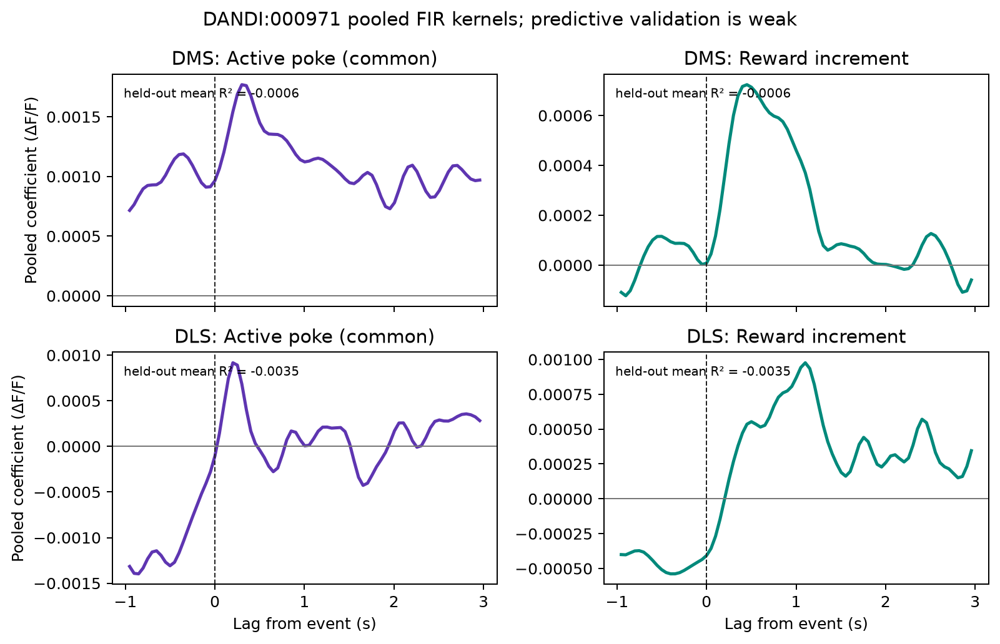

# Public behavioral event-kernel reproduction

!!! warning "Experimental result with weak held-out prediction"
    The workflow executed correctly, but the declared events did not predict a
    completely held-out animal better than its mean response on average. The
    pooled kernels are descriptive and must not be read without that result.

## Scientific question

Can overlapping action and reward responses be separated in continuous DMS and
DLS photometry while testing whether the model generalizes to animals excluded
from fitting?

This example uses Seiler et al.'s public recordings from
[DANDI:000971](https://doi.org/10.48324/dandi.000971/0.260213.1851). The source
study examined dopamine signaling during rewarded and unrewarded active nose
pokes and its relationship to compulsive behavior
([Seiler et al., 2022](https://doi.org/10.1016/j.cub.2022.01.055)). Our narrower
reanalysis tests the product's continuous encoding workflow. It is neither an
independent replication nor a reproduction of every source-study model.

## Why two event predictors?

Every reward timestamp is exactly one active-poke timestamp. Treating “rewarded
poke” and “all pokes” as unrelated event trains would obscure their relationship.
The joint model instead defines:

- **active poke:** the kernel common to all active pokes, interpretable as the
  pooled unrewarded-poke response;
- **reward increment:** the additional kernel on rewarded pokes, conditional on
  the common active-poke response.

Both use a −1 to +3 second FIR window. DMS and DLS are fitted separately after the
same 3-Hz zero-phase filtering and robust fitted-reference dF/F correction used in
the earlier public-data tutorial. The model sees complete recordings, not only
selected event windows.

## Cohort and denominator

The checksum-pinned cohort contains one session from each of six animals:

| Animal | Family | Active pokes | Rewarded | Unrewarded | 20-Hz observations |
|---|---|---:|---:|---:|---:|
| 028-392 | PR | 87 | 32 | 55 | 76,980 |
| 048-392 | PR | 124 | 25 | 99 | 74,375 |
| 272-396 | DPR | 149 | 39 | 110 | 74,368 |
| 333-393 | DPR | 246 | 49 | 197 | 72,852 |
| 112-283 | PS | 42 | 7 | 35 | 73,760 |
| 113-283 | PS | 311 | 48 | 263 | 81,423 |

There are 959 active pokes, of which 200 are rewarded, across 453,758 continuous
samples. The independent validation denominator remains six animals.

## Frozen model and result

The [protocol](https://github.com/aeronjl/fiberphotometry/blob/main/benchmarks/protocol-dandi-000971-event-kernel-v0.1.md)
was committed before the new model outcomes were inspected. It records prior use
of these fluorescence traces and prespecifies six leave-one-animal-out folds and
ridge penalties from 0 to 1000.

| Region | Selected ridge penalty | Mean animal-held-out R² | Fold range |
|---|---:|---:|---:|
| DMS | 1000 | −0.000596 | −0.00496 to 0.00080 |
| DLS | 1000 | −0.003489 | −0.01981 to 0.00018 |

Both regions selected the largest permitted penalty. Predictive performance
improved monotonically as kernels were shrunk, but remained negative on average.
For DMS, four of six animal scores were positive but tiny; for DLS, two were
positive. Animal 113-283 had the most negative score in both regions.



The pooled all-animal DMS reward-increment kernel peaks near 0.45 seconds and the
DLS increment peaks near 1.10 seconds. Those shapes are useful hypotheses, not
population estimates: the current API has no animal-level kernel uncertainty, the
regularization optimum lies beyond the tested grid, and held-out prediction is
weak.

## What this teaches us about the product

The reproduction succeeds as a workflow test and fails as evidence that this
sparse two-event design generalizes well. Several explanations remain live:

- active-poke and reward timestamps omit movement, consumption, inactive pokes,
  trial history, and motivational state;
- pooled fixed kernels may not represent heterogeneous animals;
- full-session R² is demanding when declared events occupy little of an hour-long
  recording;
- the ridge grid ends before a clear optimum;
- reference correction and model design have not yet been varied jointly.

The correct next product increment is therefore not a prettier coefficient plot.
It is animal-level kernel uncertainty plus residual diagnostics, followed by a
prospectively expanded/nested penalty design and explicit design-matrix
multiverses. The event-kernel API remains experimental.

## Reproduce it

With the six pinned assets in the documented cache:

```bash
uv run --extra nwb python examples/dandi_000971_event_kernel.py
uv run --extra plots python scripts/plot_dandi_000971_event_kernel.py
```

The committed [result artifact](https://github.com/aeronjl/fiberphotometry/blob/main/benchmarks/dandi-000971-event-kernel-v0.1/result.json)
retains both kernels, all candidate penalties, every fold score and held-out animal,
preprocessing metadata, event denominators, and source checksums.
