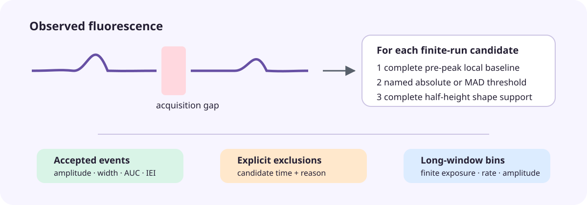

# Detect spontaneous transients without hiding the method choice

This worked simulation asks a narrow question: can we recover isolated events while
keeping acquisition gaps out of the event-rate denominator? It also demonstrates
why the detector should be treated as a small multiverse rather than a button.

<figure class="doc-figure doc-figure--wide">
  
  <figcaption><strong>The detector is a sequence of auditable decisions.</strong> Missing acquisition splits the trace first; no later measurement may bridge it.</figcaption>
</figure>

## Simulate known events and a gap

```python
import numpy as np

from fiberphotometry import (
    TransientDetectionSpec,
    detect_transients,
    make_recording,
)

rng = np.random.default_rng(4)
time = np.arange(0, 120, 0.02)
signal = rng.normal(0, 0.02, len(time))
for peak_time, amplitude, width in [
    (20, 0.5, 0.18),
    (52, 0.9, 0.25),
    (91, 0.7, 0.15),
]:
    signal += amplitude * np.exp(-0.5 * ((time - peak_time) / width) ** 2)

# A real acquisition interruption, not a region to interpolate for event finding.
signal[(time >= 59) & (time < 69)] = np.nan
recording = make_recording(
    time=time,
    signal=signal,
    channel_names=["green"],
    subject="simulation",
    session="known-events",
)
```

## Run named alternatives

```python
universes = {
    "rolling-3mad-median": TransientDetectionSpec(
        threshold_mode="rolling_mad",
        threshold=3,
        baseline_statistic="median",
    ),
    "rolling-5mad-median": TransientDetectionSpec(
        threshold_mode="rolling_mad",
        threshold=5,
        baseline_statistic="median",
    ),
    "global-3mad-minimum": TransientDetectionSpec(
        threshold_mode="global_mad",
        threshold=3,
        baseline_statistic="minimum",
    ),
}
results = {
    name: detect_transients(recording, variable="signal", spec=spec)
    for name, spec in universes.items()
}
```

For each universe, inspect both `result.events` and `result.exclusions`. Compare
the count and rate first, then ask whether the scientific conclusion survives
changes in amplitude, width, and AUC. A minimum baseline often increases measured
amplitude relative to a median baseline; that is a method consequence, not a new
biological observation.

```python
for name, result in results.items():
    summary = result.summaries[0]
    print(name, summary.count, summary.rate_per_minute)
```

## What this establishes—and what it does not

The executable regression fixtures recover a known Gaussian peak width, verify
that a shape truncated by a gap is excluded, compare named baseline alternatives,
and exercise rolling-MAD rejection. This is implementation ground truth. It is not
yet biological validation across sensors, preparations, or human annotations.

The 30-second bins are useful for plotting how event rate changes through a long
session. They remain **descriptive transient summaries**. Do not relabel them as
tonic neurotransmitter concentration without an independently justified model.

The first public-data pass is now complete. Read the
[DANDI:000251 retained result](../dandi-000251-transient-results-v0.1.md): the
universes disagree strongly, and only three of eight show enrichment in the
pre-existing post-teleport response window. Because those files contain archived
dF/F rather than raw reference channels, raw-preprocessing and manual-annotation
validation remain open.
