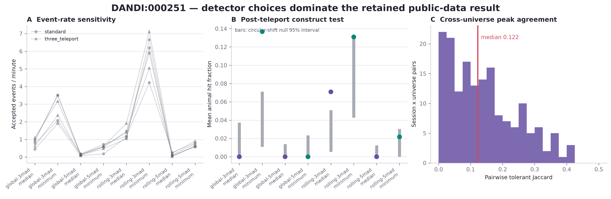

# Public dopamine-sensor transient validation: retained disagreement

!!! danger "The detector choice materially changes the result"

    Across eight prospectively frozen universes, session event rates ranged from
    **0.019 to 7.115 events/minute** and median pairwise peak-set agreement was only
    **Jaccard 0.122**. This result does not justify a universal default detector.

## The question

We used six public ventral-striatal dLight sessions from three animals in
[DANDI:000251](https://dandiarchive.org/dandiset/000251/draft), associated with
Kim et al.'s study of dopamine signals across timescales. Each animal contributed
a standard virtual-reality session and a three-teleport session. The source paper
quantified teleport-response peaks **0.6–2.1 s after teleport**, giving us an
external timing criterion that existed before this analysis.

The [protocol](https://github.com/aeronjl/fipha/blob/main/benchmarks/protocol-dandi-000251-transients-v0.1.md),
[asset manifest](https://github.com/aeronjl/fipha/blob/main/benchmarks/dandi-000251-transients-manifest-v0.1.json),
and all eight detector universes were frozen before outcomes were inspected.



## What happened

Only three of eight universes showed post-teleport enrichment relative to the
frozen circular-shift null:

| Universe | Mean animal hit fraction | Null mean | Upper-tail probability |
|---|---:|---:|---:|
| global 3-MAD, minimum baseline | 0.137 | 0.038 | 0.001 |
| rolling 3-MAD, median baseline | 0.071 | 0.025 | 0.001 |
| rolling 3-MAD, minimum baseline | 0.131 | 0.084 | 0.023 |

The remaining five universes did not show enrichment. All 5-MAD universes failed
the construct test, and animal 215 had zero teleport-window hits in every universe.
This is not a clean detector-validation success.

The larger result is instability: the minimum pre-peak baseline admits many more
events than the median baseline, and moving from 3 to 5 MAD often removes nearly
all events. Pairwise tolerant Jaccard agreement ranged from 0 to 0.425. Researchers
could therefore obtain qualitatively different event sets from superficially
reasonable choices.

## Interpretation

The result provides limited construct validity for permissive 3-MAD definitions,
but the evidence is method- and animal-dependent. It supports the package's
multiverse design: detector settings must be named, rejected candidates retained,
and downstream claims tested across alternatives.

It does **not** establish biological ground truth. The archived signal is already
dF/F, no raw reference channel is available, and task-locked enrichment does not
validate peaks outside task windows as spontaneous dopamine-release episodes. It
also does not identify a tonic component.

## Reproduce

```bash
uv run --extra nwb python scripts/run_dandi_000251_transients.py
uv run --extra plots python scripts/plot_dandi_000251_transients.py
```

The committed [result artifact](https://github.com/aeronjl/fipha/blob/main/benchmarks/dandi-000251-transients-results-v0.1.json)
contains all session/universe peak times, exclusion counts, event summaries,
external-validation statistics, pairwise agreements, and a deterministic SHA-256.

## Sources

- Kim et al., [A unified framework for dopamine signals across
  timescales](https://pmc.ncbi.nlm.nih.gov/articles/PMC7736562/).
- Bruno et al., [PASTa](https://pmc.ncbi.nlm.nih.gov/articles/PMC12224222/).
- Sherathiya et al., [GuPPy](https://pmc.ncbi.nlm.nih.gov/articles/PMC8688475/).
